<div align="center">

# mindclassify — Responsible Mental-Health Text Classification With Llama 3.1 QLoRA

**mindclassify is a research benchmark for classifiers of self-disclosed mental-health posts. It takes a labelled corpus through these steps to calibrated, safety-checked results:**

`load` → `clean` → `remove duplicates` → `split` → `fit` → `calibrate` → `evaluate` → `route`.


**[Summary](#1-summary)** ·
**[Workflow](#4-the-end-to-end-workflow)** ·
**[Run it](#14-how-to-run-mindclassify)** ·
**[Configuration](#144-environment-variables)** ·
**[Known problems](#17-known-problems)** ·
**[Glossary](#19-glossary)**

</div>

> [!NOTE]
> This README uses ASD-STE100 Simplified Technical English. The writing rules and the project
> vocabulary are in [`docs/ste-style-guide.md`](docs/ste-style-guide.md). Each term in the
> [Glossary](#19-glossary) has only one meaning.

> [!WARNING]
> Do not use mindclassify to diagnose, screen or triage a person. It is research software, not a medical device.
> A qualified person must review every case. A post with suicidal content must go to a human reviewer and to crisis resources.
> The corpus labels come from public forums, not from clinicians, and the corpus contains platform and demographic bias.

---

mindclassify measures how well models classify the language of public mental-health posts into seven labels.
It keeps the `Suicidal` label, removes copies and near copies before the split, and keeps each duplicate group on one side.
All models give class probabilities over the same label order. An LLM gives them by label scoring, not by parsing a generated answer.
Training, evaluation and prediction use one prompt template, and a test checks this.
Macro-F1 with a bootstrap interval is the primary metric, and a routing rule sends possible crisis posts to a human.

This README is the **one location that explains all of mindclassify**. It gives these topics:

- the general design
- each component and its procedure, step by step
- the decision rules
- the data map
- the runbook
- the validation results and the known problems

| If you are… | Read |
|---|---|
| A manager or reviewer | [1](#1-summary), [3](#3-design-rules), [4](#4-the-end-to-end-workflow), [16](#16-validation-results), [18](#18-key-points) |
| A developer who joins the project | All sections, in sequence. Keep [14](#14-how-to-run-mindclassify) and [17](#17-known-problems) open while you work |
| A researcher who runs mindclassify | [14](#14-how-to-run-mindclassify), then the section for the component that you use |

---

## Table of contents

1. 🧭 [Summary](#1-summary)
2. 🏗️ [How mindclassify is built](#2-how-mindclassify-is-built)
   - 2.1 [Components](#21-components)
   - 2.2 [System context](#22-system-context)
   - 2.3 [Repository layout](#23-repository-layout)
3. 🛡️ [Design rules](#3-design-rules)
4. 🔄 [The end-to-end workflow](#4-the-end-to-end-workflow)
   - 4.1 [Full flow](#41-full-flow)
   - 4.2 [The life cycle of one post](#42-the-life-cycle-of-one-post)
   - 4.3 [Who does which step](#43-who-does-which-step)
5. 📥 [The loader and the cleaner](#5-the-loader-and-the-cleaner)
6. 🧬 [Duplicate groups and the split](#6-duplicate-groups-and-the-split)
7. 💬 [The prompt template](#7-the-prompt-template)
8. 🔵 [The baselines](#8-the-baselines)
9. 🟣 [The LLM label scorer and QLoRA](#9-the-llm-label-scorer-and-qlora)
10. 🎯 [Calibration](#10-calibration)
11. 🚨 [The safety routing rule](#11-the-safety-routing-rule)
12. 📊 [The evaluation and the report](#12-the-evaluation-and-the-report)
13. 🗂️ [Data and file map](#13-data-and-file-map)
14. ▶️ [How to run mindclassify](#14-how-to-run-mindclassify)
    - 14.1 [Prerequisites](#141-prerequisites) · 14.2 [Installation](#142-installation) · 14.3 [Run mindclassify](#143-run-mindclassify) · 14.4 [Environment variables](#144-environment-variables)
15. 🧩 [How to extend mindclassify](#15-how-to-extend-mindclassify)
16. ✅ [Validation results](#16-validation-results)
17. ⚠️ [Known problems](#17-known-problems)
18. 📌 [Key points](#18-key-points)
19. 📖 [Glossary](#19-glossary)
20. 📄 [License](#20-license)

---

## 1. Summary

**The problem.** A public corpus of about 53,000 labelled posts invites a quick fine-tune and one accuracy number. These questions are difficult:

- How do you prevent copies of one post in the train split and the test split?
- How do you make sure that the deployed prompt is the evaluated prompt?
- How do you get class probabilities from an LLM that you can trust?
- How do you measure the small labels, not only the large ones?
- What happens to a post with suicidal content?

mindclassify gives each of these questions its own component. Each component has unit tests.

| Item | Value |
|---|---|
| Input | `Combined Data.csv` (`statement`, `status`, optional `source`), or synthetic template posts |
| Output | Model folders with a model card, `report.md`, class probabilities and a routing decision for one text |
| Components | **13** modules: config, data, clean, dedup, splits, prompts, models (base, tfidf, llm, qlora), evaluate, safety, report, pipeline, synthetic, cli |
| Labels | Normal, Depression, Suicidal, Anxiety, Bipolar, Stress, Personality disorder |
| Models | `majority`, `tfidf` (local), LLM zero-shot and QLoRA (extra `llm`, GPU) |
| Offline mode | Synthetic posts, the majority and TF-IDF models, all metrics and the routing rule |
| Safety | `Suicidal` is kept, a routing rule with a crisis-phrase list, a disclaimer on each output |
| Tests | **25** unit tests pass (`pytest`). None needs a GPU or a download |

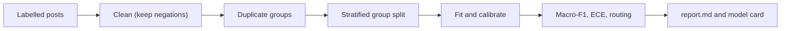

---

## 2. How mindclassify is built

### 2.1 Components

| Component | Module | Purpose |
|---|---|---|
| Settings | `src/mindclassify/config.py` | `Settings` from environment variables, masked `HF_TOKEN` |
| Loader | `src/mindclassify/data.py` | Common schema, label normalisation, load report |
| Cleaner | `src/mindclassify/clean.py` | URL, mention and HTML handling. Negations stay |
| Duplicate groups | `src/mindclassify/dedup.py` | Exact copies, MinHash near copies, union-find, conflict resolution |
| Splits | `src/mindclassify/splits.py` | Stratified group split, saved IDs, leakage check |
| Prompt template | `src/mindclassify/prompts.py` | The one template, completions, completion-only labels |
| Model interface | `src/mindclassify/models/base.py` | `Classifier`, softmax with temperature, `MajorityClassifier` |
| TF-IDF baseline | `src/mindclassify/models/tfidf.py` | Word and character TF-IDF with balanced logistic regression |
| LLM scorer | `src/mindclassify/models/llm.py` | Label scoring with a 4-bit base model and an optional adapter |
| QLoRA training | `src/mindclassify/models/qlora.py` | LoRA on all linear layers, completion-only loss, early stopping |
| Evaluation | `src/mindclassify/evaluate.py` | Macro-F1 and interval, calibration, slices, routing metrics |
| Safety | `src/mindclassify/safety.py` | Crisis-phrase list and the combined routing rule |
| Report | `src/mindclassify/report.py` | `report.md` and `MODEL_CARD.md` |
| Pipeline | `src/mindclassify/pipeline.py` | `prepare`: load, clean, group, split |
| Synthetic posts | `src/mindclassify/synthetic.py` | Template posts with imbalance, near classes, noise and copies |
| CLI | `src/mindclassify/cli.py` | The `mindclassify` command with 8 subcommands |

The component map shows which module calls which module. An arrow points from the caller to the module that it uses.

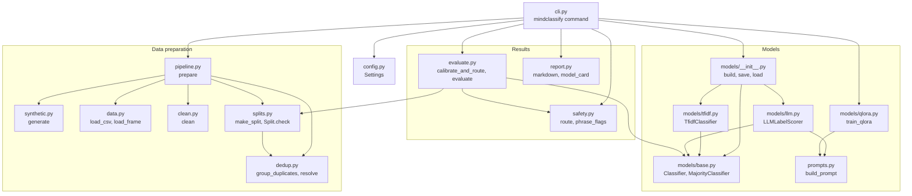

### 2.2 System context

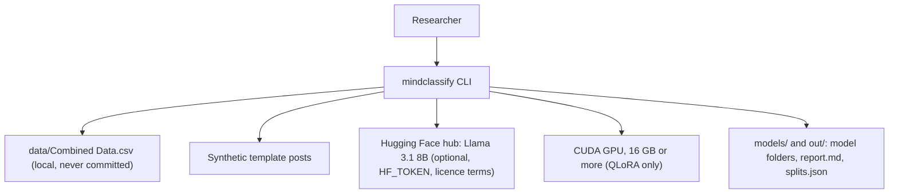

### 2.3 Repository layout

```
mindclassify/
├── .github/workflows/ci.yml        # CI: Python 3.11, pip install -e ".[dev]", pytest -q
├── .env.example                    # all 14 variables, empty
├── pyproject.toml                  # package, extras (llm, dev), mindclassify script
├── data/README.md                  # source, terms, columns, sensitivity
├── docs/ste-style-guide.md         # writing rules and project vocabulary
├── src/mindclassify/
│   ├── config.py  data.py  clean.py          # settings, loader, cleaner
│   ├── dedup.py  splits.py  prompts.py       # duplicate groups, splits, the prompt template
│   ├── models/                               # base, tfidf, llm (label scoring), qlora
│   ├── evaluate.py  safety.py  report.py     # metrics, routing, reports
│   └── pipeline.py  synthetic.py  cli.py     # prepare, template posts, command line
└── tests/                                    # 25 tests, no GPU, no network
```

---

## 3. Design rules

### 3.1 One prompt template
`prompts.build_prompt` is the only prompt function. The QLoRA encoder and the LLM scorer import it, and a test checks that they use the same object. The model folder stores the template version, and `load` refuses a different version.

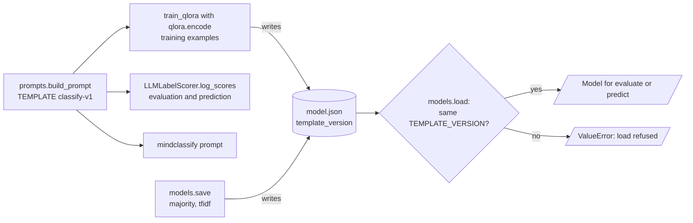

### 3.2 Scores over labels, not parsed text
The LLM scorer adds each label completion to the prompt and sums its token log-probabilities. A softmax over the labels gives the class probabilities. No answer text is generated or parsed.

### 3.3 No copy crosses a split
`dedup.group_duplicates` puts exact copies and MinHash near copies into one group. One post stays for each group. The split is a stratified group split, and `Split.check` raises `LeakageError` if a group or a normalised text is on two sides.

### 3.4 The Suicidal label stays
The loader keeps all seven labels. The routing rule sends a post to a human if P(Suicidal) reaches the threshold or the post contains a crisis phrase.

### 3.5 Macro-F1 comes first
The report gives macro-F1 with a 95% bootstrap interval, the per-class results and the slices by source and length. Accuracy is in the table but never alone.

### 3.6 Probabilities are calibrated
Each model gets a temperature that is fit on the validation split. The report gives the ECE.

### 3.7 The cleaner keeps the signal
The cleaner changes only URLs, mentions, HTML and white space. It keeps negations, pronouns, case and word order. Slang expansion is off by default and changes only whole tokens.

### 3.8 Secrets stay in the environment
`HF_TOKEN` is a hidden field. `mindclassify config` shows only `set` or `not set`. A test fails if a notebook with outputs is in the repository.

---

## 4. The end-to-end workflow

### 4.1 Full flow

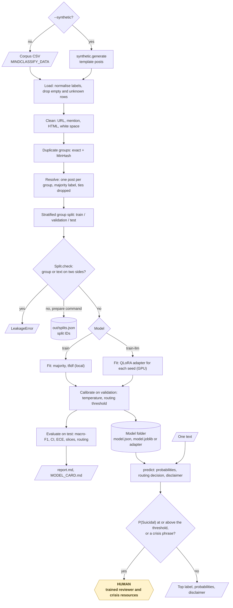

### 4.2 The life cycle of one post

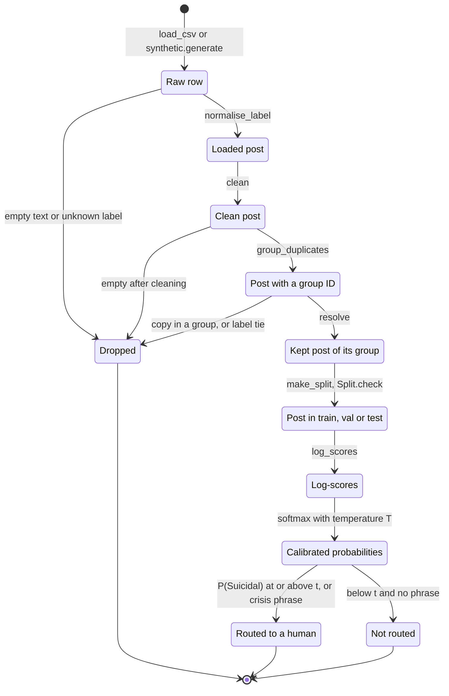

1. The loader reads the post and normalises its label (for example `Bi-Polar` to `Bipolar`).
2. The cleaner replaces its URLs and mentions with `<url>` and `<user>`.
3. The duplicate step finds copies of the post and keeps one post of the group.
4. The split puts the group into the train, validation or test split.
5. A model gives the post one log-score for each label.
6. The softmax with the calibration temperature gives the class probabilities.
7. The routing rule checks P(Suicidal) and the crisis phrases.
8. The output gives the top label, all probabilities, the routing decision and the disclaimer.

### 4.3 Who does which step

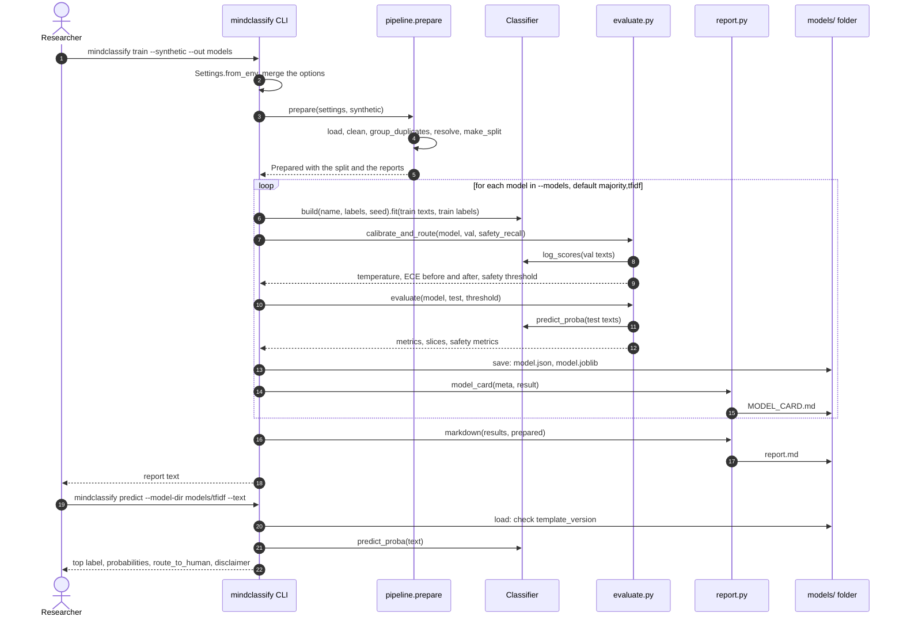

---

## 5. The loader and the cleaner

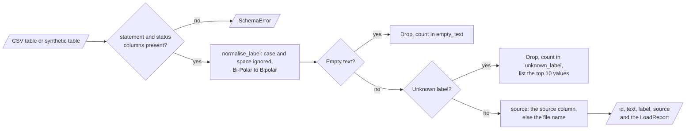

| Loader rule | Value |
|---|---|
| Text column, label column | `statement`, `status` |
| Label normalisation | Case and space are ignored. `Bi-Polar` and `bi polar` become `Bipolar` |
| Empty text | Dropped and counted |
| Unknown label | Dropped, counted and listed (top 10 values) |
| Source | The `source` column, else the file name |

```mermaid
flowchart LR
    T[/"Post text and CleanConfig"/] --> H{"html?"}
    H -- "on" --> H1["html.unescape,<br/>tags to spaces"]
    H -- "off" --> U
    H1 --> U{"urls?"}
    U -- "on" --> U1["URL to the url placeholder"]
    U -- "off" --> M
    U1 --> M{"mentions?"}
    M -- "on" --> M1["Mention to the user placeholder"]
    M -- "off" --> S
    M1 --> S{"expand_slang?<br/>default off"}
    S -- "on" --> S1["Whole tokens only,<br/>keep the case style"]
    S -- "off" --> L
    S1 --> L{"lowercase?<br/>default off"}
    L -- "on" --> L1["Lower case"]
    L -- "off" --> W
    L1 --> W["Join white space, strip"]
    W --> OUT[/"Clean text, negations kept"/]
```

| Cleaner step | Default | Example |
|---|---|---|
| HTML entities and tags | On | `&amp;` → `&`, `<b>today</b>` → `today` |
| URLs | On | `https://x.y/z` → `<url>` |
| Mentions | On | `@friend` → `<user>` |
| Slang expansion | Off | `u` → `you`, `U` → `You`. `time` stays `time` |
| Lower case | Off | — |
| Stop-word removal, stemming | Not available | They remove negations and change meaning |

---

## 6. Duplicate groups and the split

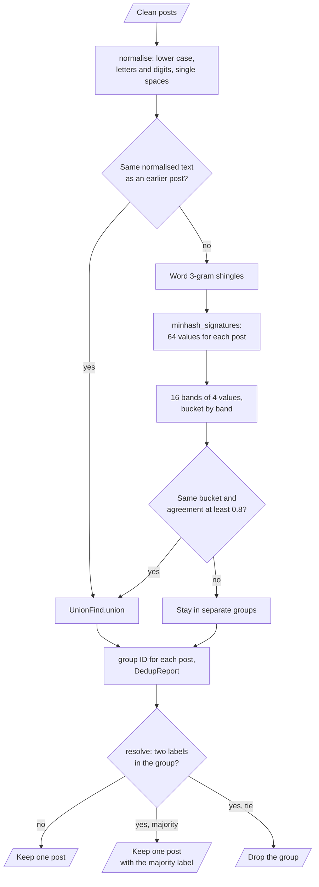

**Procedure**

1. Normalise each post: lower case, letters and digits only, single spaces.
2. Join posts with the same normalised text (exact copies).
3. Make word 3-gram shingles and a 64-value MinHash signature for each post.
4. Put signatures into 16 bands of 4 values. Posts with an equal band are candidates.
5. Join two candidates if at least 80% of their signature values agree.
6. Keep one post for each group. If the group has two labels, keep the majority label. If the labels tie, drop the group.
7. Carve the test split with `StratifiedGroupKFold` as 1 fold of round(1 / test size) folds. With the default 0.15, this is 1 fold of 7, about 14% of the posts. Then carve the validation split from the rest in the same way (1 fold of 6, also about 14% of all posts).
8. Run `Split.check` and save the split IDs to `splits.json`.

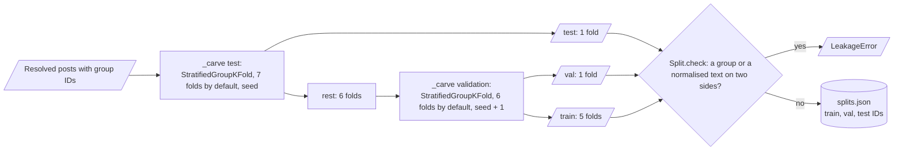

---

## 7. The prompt template

```
Classify the mental-health category of the post. Answer with exactly one label from this list: Normal, Depression, Suicidal, Anxiety, Bipolar, Stress, Personality disorder.

Post: <post text with single spaces>
Label:
```

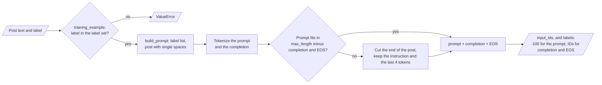

| Item | Value |
|---|---|
| Version | `classify-v1` |
| Completion | A space and the label, for example ` Depression` |
| Training labels | Prompt tokens get −100. Only the completion tokens and EOS carry a loss |
| Truncation | The end of the post is cut. The instruction and the last 4 prompt tokens (`Label:`) stay |

`mindclassify prompt` prints the template.

---

## 8. The baselines

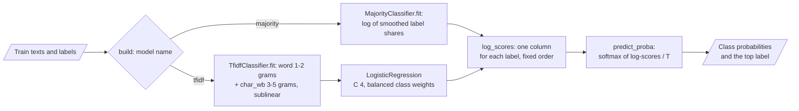

| Model | What it is | Role |
|---|---|---|
| `majority` | Always the most frequent training label | The floor of each metric |
| `tfidf` | Word 1–2 grams and character 3–5 grams (TF-IDF, sublinear), logistic regression with balanced class weights (C = 4) | The strong classical baseline |

An LLM result is useful only if it is better than `tfidf` on macro-F1, with intervals that do not overlap.

---

## 9. The LLM label scorer and QLoRA

**Label scoring** (zero-shot or with an adapter)

1. Build the prompt with `build_prompt`.
2. For each label, add the completion tokens to the prompt tokens.
3. Run the model and sum the log-probabilities of the completion tokens.
4. The 7 sums are the log-scores. A softmax with the temperature gives the probabilities.

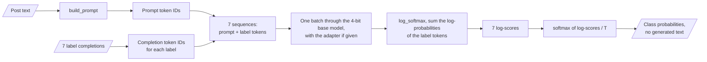

**QLoRA training** (`mindclassify train-llm`, GPU)

| Setting | Value |
|---|---|
| Base model | `meta-llama/Meta-Llama-3.1-8B-Instruct` (`MINDCLASSIFY_BASE_MODEL`) |
| Quantisation | 4-bit NF4, double quantisation, bfloat16 compute |
| LoRA | r = 16, alpha = 32, dropout 0.05, all linear layers |
| Loss | Completion only |
| Schedule | 2 epochs, learning rate 2e-4, cosine, warm-up 3%, paged AdamW 8-bit |
| Batch | 4 × 4 gradient accumulation |
| Early stopping | Validation loss after each epoch, patience 1, best checkpoint kept |
| Seeds | `--seeds 42,43,44` trains one adapter for each seed |

After training, the command fits the temperature and the routing threshold on the validation split and writes them to `model.json`.

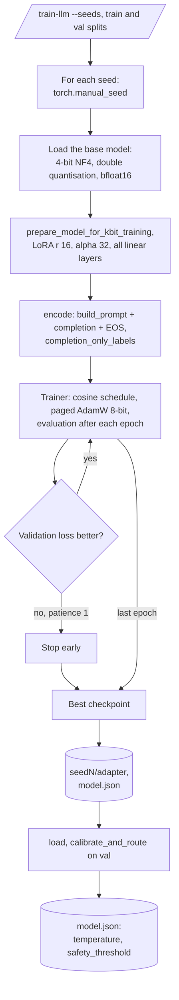

---

## 10. Calibration

1. Get the log-scores of the validation posts.
2. Find the temperature T in [0.05, 20] with the lowest negative log-likelihood.
3. Store T in the model folder. Every prediction divides the log-scores by T before the softmax.
4. Report the ECE (15 equal-width confidence bins) before and after.

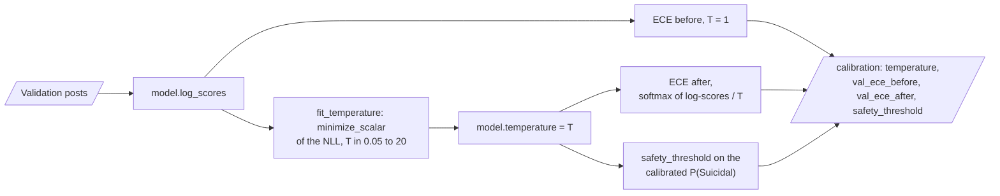

---

## 11. The safety routing rule

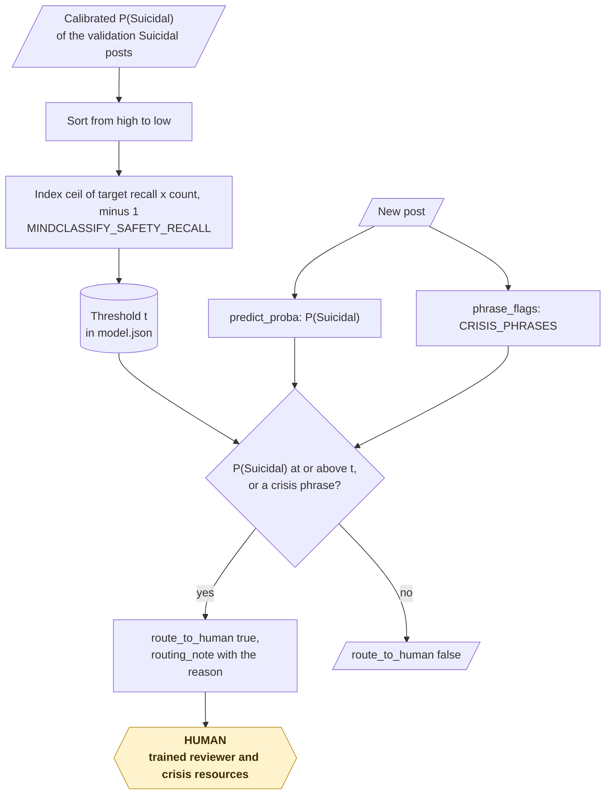

**Procedure**

1. On the validation split, sort the P(Suicidal) values of the `Suicidal` posts.
2. Select the highest threshold that reaches the target recall (`MINDCLASSIFY_SAFETY_RECALL`, default 0.9).
3. For a new post, route it to a human if P(Suicidal) ≥ threshold.
4. Also route it if the post contains a crisis phrase (for example `end it`, `want to die`, `no way out`, `suicid…`).
5. The output gives the reason for the routing.

**Rules**

- The crisis-phrase list in `safety.py` is a start for review by a clinical safety team. It is not complete.
- The report gives recall, precision and the routed share of the threshold rule, and of the threshold rule plus phrases.

---

## 12. The evaluation and the report

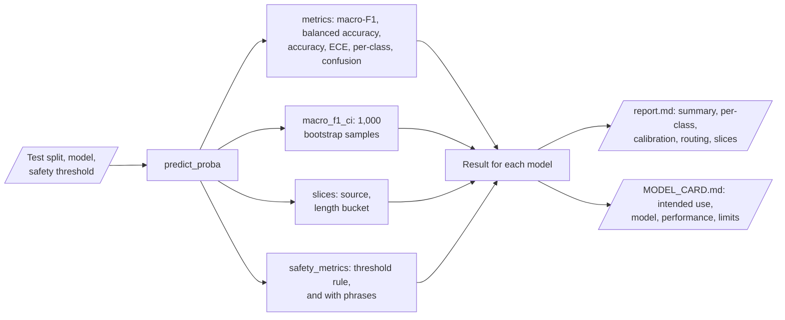

| Output | Content |
|---|---|
| Summary table | Macro-F1, 95% bootstrap interval (1,000 samples), balanced accuracy, accuracy, ECE, routing recall |
| Per-class table | Precision, recall, F1, support for each label |
| Calibration line | Temperature and the validation ECE before and after |
| Routing lines | Threshold, recall, precision, routed share, with and without phrases |
| Slices | Macro-F1 by source and by length (≤ 20, 21–60, > 60 words) |
| `MODEL_CARD.md` | Intended use, model, performance, limits and bias |

---

## 13. Data and file map

| Path | Committed? | Contents |
|---|---|---|
| `data/README.md` | Yes | Source, terms, columns, sensitivity |
| `data/Combined Data.csv` | No (git ignores it) | The corpus |
| `data/synthetic.csv` | No (git ignores it) | Output of `mindclassify synth` |
| `out/splits.json` | No (git ignores it) | The split IDs from `mindclassify prepare` |
| `models/<name>/model.json`, `model.joblib`, `MODEL_CARD.md` | No (git ignores them) | Saved model folders |
| `models/qlora/seed<N>/adapter/` | No (git ignores it) | LoRA adapters |
| `models/report.md` | No (git ignores it) | Output of `mindclassify train` |
| `.env.example` | Yes | All 14 variables, empty |
| `.env` | No (git ignores it) | Local settings and `HF_TOKEN` |

---

## 14. How to run mindclassify

### 14.1 Prerequisites

| Need | For |
|---|---|
| Python 3.11+ | All components |
| `numpy`, `pandas`, `scipy`, `scikit-learn` | All local components (installed with the package) |
| `torch`, `transformers`, `peft`, `accelerate`, `bitsandbytes` (extra `llm`) | LLM scoring and QLoRA |
| A CUDA GPU with 16 GB or more | QLoRA on Llama 3.1 8B |
| `HF_TOKEN` and accepted Llama 3.1 licence terms | The base model download |

### 14.2 Installation

```bash
git clone https://github.com/KrishnaAnnavaram/mindclassify.git
cd mindclassify
python -m venv .venv
. .venv/bin/activate            # Windows: .venv\Scripts\activate
pip install -e ".[dev]"         # add ,llm for the LLM parts
```

### 14.3 Run mindclassify

Offline (synthetic template posts):

```bash
mindclassify prepare --synthetic
mindclassify train --synthetic --out models
mindclassify evaluate --synthetic --model-dir models/tfidf --out out
mindclassify predict --model-dir models/tfidf --text "Great football match with my cousin this weekend"
mindclassify prompt
mindclassify config
```

With the corpus (see `data/README.md`) and a GPU:

```bash
mindclassify prepare
mindclassify train --out models
mindclassify train-llm --seeds 42,43,44 --out models/qlora
mindclassify evaluate --model-dir models/qlora/seed42 --out out/qlora42
```

Each command runs `prepare` again with the same seed, so all commands use the same split. The files connect the commands in this sequence:

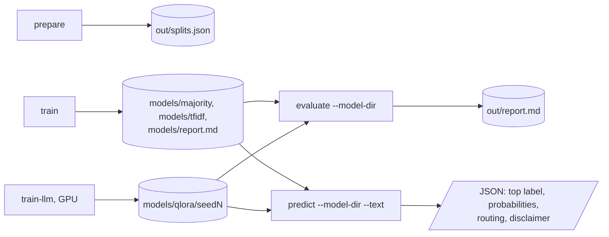

### 14.4 Environment variables

| Variable | Used by | Meaning |
|---|---|---|
| `MINDCLASSIFY_DATA` | Loader | Corpus CSV. Default `data/Combined Data.csv` |
| `MINDCLASSIFY_OUT_DIR` | `prepare`, `evaluate` | Default `out` |
| `MINDCLASSIFY_SEED` | Split, models | Default 42 |
| `MINDCLASSIFY_TEST_SIZE`, `MINDCLASSIFY_VAL_SIZE` | Split | Default 0.15 each |
| `MINDCLASSIFY_NEAR_DUP_THRESHOLD` | Duplicate groups | MinHash agreement. Default 0.8 |
| `MINDCLASSIFY_SAFETY_RECALL` | Routing | Target recall on validation. Default 0.9 |
| `MINDCLASSIFY_BASE_MODEL` | LLM | Default `meta-llama/Meta-Llama-3.1-8B-Instruct` |
| `MINDCLASSIFY_LORA_R`, `MINDCLASSIFY_LORA_ALPHA` | QLoRA | Default 16 and 32 |
| `MINDCLASSIFY_EPOCHS`, `MINDCLASSIFY_LEARNING_RATE` | QLoRA | Default 2 and 2e-4 |
| `MINDCLASSIFY_MAX_LENGTH` | QLoRA | Token limit. Default 384 |
| `HF_TOKEN` | LLM | Hugging Face token. Never printed |

Credentials are only in a local `.env` file or the environment. Git ignores `.env`. Do not print or commit credentials.

---

## 15. How to extend mindclassify

| You want to… | Do this | Code change? |
|---|---|---|
| Use another base model | Set `MINDCLASSIFY_BASE_MODEL` | No |
| Change the routing recall | Set `MINDCLASSIFY_SAFETY_RECALL` | No |
| Add a corpus | Write a CSV with `statement`, `status`, `source` and join it before `prepare` | Small |
| Add an encoder baseline (for example RoBERTa) | Make a `Classifier` with `fit` and `log_scores`, add it to `LOCAL` | Small |
| Measure a cleaning step | Run `prepare` with a different `CleanConfig` and compare the reports | Small |
| Change the prompt | Edit `TEMPLATE` and change `TEMPLATE_VERSION`. Old model folders then refuse to load | Small |

---

## 16. Validation results

| Validation | Result | Command |
|---|---|---|
| Unit tests (CI installs only `.[dev]`) | **25 passed, 0 skipped**. No test needs a GPU, a download or an extra | `pytest -q` |
| Duplicate removal (synthetic, 4,280 posts) | 160 exact copies, 120 near-copy links, 280 posts removed, 0 label conflicts | `mindclassify prepare --synthetic` |
| `majority` on the synthetic test split (572 posts) | Macro-F1 0.060 [0.054, 0.067], accuracy 0.267 | `mindclassify train --synthetic` |
| `tfidf` on the synthetic test split | Macro-F1 0.862 [0.827, 0.891], balanced accuracy 0.860, accuracy 0.872, ECE 0.042 | same |
| `tfidf` calibration | Temperature 0.954, validation ECE 0.064 → 0.059 | same |
| `tfidf` Suicidal routing | Threshold 0.401: recall 0.878, precision 0.808, routed share 0.219. With phrases: recall 0.957, precision 0.618, routed share 0.311 | same |
| `tfidf` slices | Macro-F1 0.881 for `forum_a`, 0.834 for `forum_b` | same |

All numbers are from SYNTHETIC template posts (seed 42). The posts come from word lists, so the TF-IDF result is much higher than on real posts.
The numbers prove that the pipeline works end to end. They say nothing about real mental-health text.
The routing threshold reached 0.9 recall on the validation split but only 0.878 on the test split. The crisis-phrase rule raised the recall to 0.957, with more posts routed.
The LLM zero-shot and QLoRA paths need a GPU and are not run in CI. No LLM number is reported here.
The prototype reported "78.4% macro" in one place and "above 90%" in another, on a 300-post test set. These are prototype results and are not reproduced here.

---

## 17. Known problems

Read these problems before you use mindclassify for research.

| # | Area | Problem | Impact and action |
|---|---|---|---|
| 1 | Results | No result on the real corpus and no LLM result is in this README | Run `train` and `train-llm` on the corpus with 3 seeds and publish the macro-F1 intervals |
| 2 | LLM code | The label scorer and the QLoRA trainer are not tested in CI | Run them on a GPU before you trust a number. Check the library versions in `pyproject.toml` |
| 3 | Labels | The labels come from the forum or the source dataset, not from clinicians | A label is a topic signal, not a diagnosis |
| 4 | Safety | The routing rule missed 12% of the synthetic test `Suicidal` posts without the phrase list | Keep the phrase rule on, review the list with experts, and never use the tool for real triage |
| 5 | Bias | The corpus over-represents some platforms, languages and groups | Report the slices. Do not generalise to other populations |
| 6 | Label scoring | Multi-token labels (`Personality disorder`) get a sum of more token log-probabilities | The calibration temperature reduces, but does not remove, this length effect |
| 7 | Near copies | MinHash with word 3-grams misses paraphrases | Some related posts can still cross the split |
| 8 | Model files | `model.joblib` uses pickle | Load only model folders that you made |

---

## 18. Key points

1. **One prompt template.** Training, evaluation and prediction call the same function, and a test checks it.
2. **Probabilities come from label scoring.** No answer is generated or parsed, and the probabilities are calibrated.
3. **No copy crosses a split.** Duplicate groups stay on one side, and a leakage check runs each time.
4. **The Suicidal label stays.** A routing rule with a phrase list sends possible crisis posts to a human.
5. **Macro-F1 with an interval comes first.** The majority and TF-IDF baselines give the reference levels.
6. **It is research software.** Each output carries a disclaimer, and the model card states the limits.

---

## 19. Glossary

| Term | Meaning |
|---|---|
| **Completion** | A space and the label text after the prompt |
| **Crisis phrase** | A text pattern in `safety.py` that always routes a post |
| **Duplicate group** | Posts that are copies or near copies of each other |
| **ECE** | Expected calibration error with 15 bins |
| **Label** | One of the 7 categories of the corpus |
| **Label scoring** | The sum of the token log-probabilities of a completion |
| **Macro-F1** | The mean of the F1 scores of all labels |
| **MinHash** | A signature whose agreement estimates the word-shingle overlap of two posts |
| **Model folder** | `model.json` plus `model.joblib` or a LoRA adapter |
| **Post** | One text of the corpus |
| **Prompt template** | The one text frame around a post (`classify-v1`) |
| **QLoRA** | LoRA fine-tuning on a 4-bit quantised base model |
| **Routing rule** | P(Suicidal) at or above the threshold, or a crisis phrase |
| **Split** | The train, validation or test part of the corpus |
| **Temperature** | The calibration divisor of the log-scores |

---

## 20. License

[MIT](LICENSE) © 2026 Krishna Annavaram
